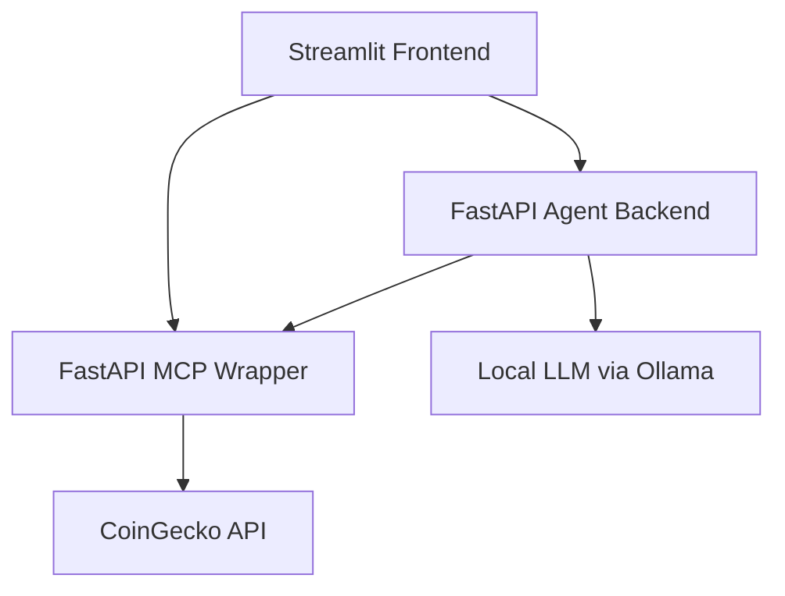

# Crypto Intelligence Agent

Crypto Intelligence Agent is a local agentic web application for exploratory crypto market analysis. It combines a local LLM with tool-calling, a FastAPI-based MCP-style wrapper for live market data, and a Streamlit interface with a lightweight decision-support dashboard. The project is designed to ground market answers in normalized live data rather than relying on model guesses.

Demo video: [docs/demo/crypto-intelligence-agent-demo.mp4](docs/demo/crypto-intelligence-agent-demo.mp4)

## Key Features

- Real-time crypto price lookup through normalized wrapper endpoints
- Side-by-side comparison for two assets
- Trending coins and market summary views
- Lightweight dashboard with top performers, comparison cards, and 7-day candlestick-style chart views
- Tool trace / transparency panel showing tool used, input, and returned-data summary
- Symbol normalization for common names and minor typos
- Local Ollama support for fully local LLM orchestration
- Graceful fallback when live market data is slow, rate-limited, or unavailable
- Lightweight in-memory caching in the wrapper to improve demo reliability

## Architecture Overview



## How It Works

1. A user asks a natural-language crypto question in the Streamlit app.
2. The agent backend interprets the prompt and chooses a constrained tool path.
3. The selected tools call the MCP-style wrapper instead of calling CoinGecko directly.
4. The wrapper normalizes external API responses into stable internal shapes.
5. The backend composes a grounded response using tool results and cautious wording.
6. The frontend renders the response, an execution trace, and supporting dashboard visuals.

## Repository Structure

```text
crypto-intelligence-agent/
├── agent_backend/
│   ├── agent.py
│   ├── main.py
│   ├── prompts.py
│   └── tools.py
├── docs/
│   ├── architecture.md
│   ├── demo-script.md
│   └── demo_notes.md
├── frontend/
│   └── app.py
├── mcp_server/
│   ├── main.py
│   ├── schemas.py
│   └── services/
│       └── coingecko_service.py
├── tests/
│   └── test_agent_logic.py
├── .env.example
├── Dockerfile
├── docker-compose.yml
├── requirements.txt
└── README.md
```

## Setup Instructions

1. Create and activate a virtual environment.
2. Install Python dependencies.
3. Copy `.env.example` to `.env`.
4. Install and start Ollama locally.
5. Pull the default local model.

```bash
cd /Users/utkarshmishra/Documents/Playground/crypto-intelligence-agent
python3 -m venv ../.venv
source ../.venv/bin/activate
pip install -r requirements.txt
cp .env.example .env
ollama pull qwen2.5:7b
```

Then start the services in separate terminals:

Terminal 1:
```bash
cd /Users/utkarshmishra/Documents/Playground/crypto-intelligence-agent
source ../.venv/bin/activate
uvicorn mcp_server.main:app --reload --port 8001
```

Terminal 2:
```bash
cd /Users/utkarshmishra/Documents/Playground/crypto-intelligence-agent
source ../.venv/bin/activate
uvicorn agent_backend.main:app --reload --port 8000
```

Terminal 3:
```bash
cd /Users/utkarshmishra/Documents/Playground/crypto-intelligence-agent
source ../.venv/bin/activate
streamlit run frontend/app.py
```

Open the frontend at [http://127.0.0.1:8501](http://127.0.0.1:8501).

## Environment Variables

Copy [.env.example](/Users/utkarshmishra/Documents/Playground/crypto-intelligence-agent/.env.example) to `.env` and configure:

- `LLM_BASE_URL`
  OpenAI-compatible endpoint for the local LLM server. Default: `http://localhost:11434/v1`
- `LLM_API_KEY`
  Local key placeholder for Ollama-compatible usage. Default: `ollama`
- `LLM_MODEL`
  Local model name used by the backend. Default: `qwen2.5:7b`
- `MCP_BASE_URL`
  Base URL for the FastAPI wrapper service. Default: `http://localhost:8001`
- `AGENT_BACKEND_URL`
  Base URL used by the Streamlit frontend to call the agent backend. Default: `http://localhost:8000`

## Example Queries

- `What is the current price of Bitcoin?`
- `Compare BTC and ETH today`
- `Which coins are trending right now?`
- `Show me a market summary`
- `What should I look at in the market right now?`
- `Which coin is doing better today, BTC or ETH?`

Note: broad market prompts are intentionally constrained to a smaller tool path for demo reliability.

## Dashboard

The dashboard is a visualization layer, not the reasoning engine. It uses the same normalized MCP wrapper data to display tracked market metrics, top-performing assets, comparison views, and 7-day trend charts. The core reasoning flow still runs through the agent backend and its tool-calling logic.

## Reliability / Known Limitations

- Local-only workflow by default
- Depends on CoinGecko free endpoints, which may rate-limit or respond slowly
- No persistent database or long-term storage
- Historical charting is intentionally lightweight
- Dashboard chart views are derived from normalized OHLC market data and simplified for readability
- Broad prompts are scoped for speed rather than maximum coverage
- Wrapper caching is in-memory only and resets when the process restarts
- Test coverage is lightweight and focused on planning and reliability helpers, not full integration coverage

## Future Improvements

- Broader automated integration testing
- Optional news or headline correlation
- More robust frontend error states and partial-response rendering
- Stronger containerized dev workflow
- Richer dashboard filtering and asset search

## Version / Release Status

- Current status: `v0.1.0-alpha`
- Local end-to-end working prototype
- Core features implemented
- Not yet production hardened
