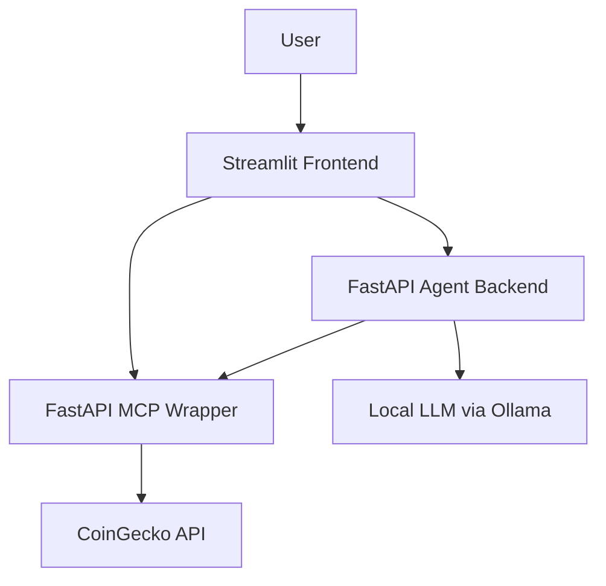
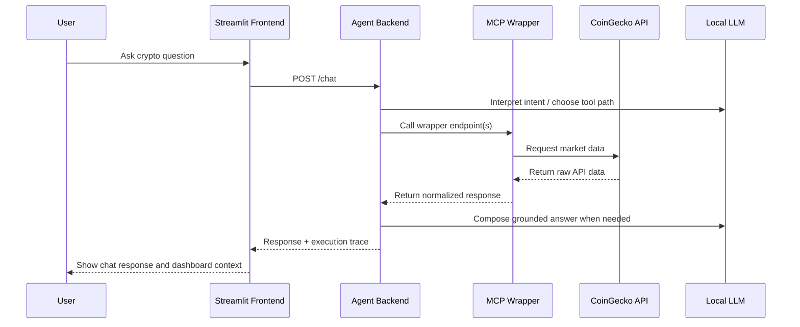

# Architecture

## Purpose

This project uses a wrapper-based architecture so the agent backend does not depend directly on third-party crypto API shapes. The MCP-style wrapper owns external API interaction, response normalization, short-lived caching, and reliability guards, while the agent focuses on prompt interpretation and tool orchestration.

## Service Responsibilities

### Frontend

The Streamlit frontend provides two user-facing surfaces:

- an agent chat experience for natural-language questions
- a lightweight dashboard for decision-support visuals

It also renders a safe execution trace that shows which tools were used, the input that was passed, and a brief summary of returned data.

### Agent Backend

The FastAPI agent backend accepts `POST /chat` requests, interprets user intent, selects tools, and returns grounded answers. It supports:

- tool-calling through a local Ollama-compatible LLM
- deterministic fast paths for broad prompts such as market-summary style questions
- cautious finance wording
- graceful fallback when live market data is unavailable or too slow

### MCP Wrapper

The FastAPI MCP wrapper is the market-data integration layer. It is responsible for:

- symbol resolution
- normalized response shapes
- short-term in-memory caching for demo resilience
- timeout handling
- rate-limit normalization for upstream CoinGecko failures

Current wrapper endpoints:

- `GET /health`
- `GET /price?symbol=btc`
- `GET /compare?symbol1=btc&symbol2=eth`
- `GET /trending`
- `GET /market-summary`
- `GET /trend?symbol=btc&days=7`
- `GET /ohlc?symbol=btc&days=7`

### External Dependencies

- CoinGecko free API for market data
- Local Ollama server for OpenAI-compatible chat completions

## Architecture Diagram

## Request Lifecycle

## Design Decisions

### Why the LLM Does Not Call Third-Party APIs Directly

Direct third-party API access from the LLM would tightly couple the reasoning layer to unstable upstream response formats and make error handling harder to control. The wrapper keeps API logic deterministic and easier to validate.

### Why Normalized Responses Matter

Normalized responses reduce frontend and backend complexity. The chat agent and dashboard can both consume the same stable internal shape without custom parsing for each CoinGecko endpoint.

### Why the Dashboard Is Separate from the Reasoning Layer

The dashboard is intended to support interpretability and exploratory analysis, not replace the agent. The reasoning path still runs through the backend and tool system, while the dashboard surfaces the same live data visually.

## Operational Notes

- The free upstream API can rate-limit or respond slowly during demos.
- The wrapper includes short-term in-memory caching to reduce repeated upstream calls.
- The wrapper and agent both enforce explicit timeouts to prevent indefinite waits.
- Broad prompts such as “What should I look at in the market right now?” are constrained to a fast path for reliability.
- The dashboard candlestick charts are rendered from normalized OHLC data and then compressed into a readable daily view on the frontend.
- This is a local working prototype, not a production deployment.
